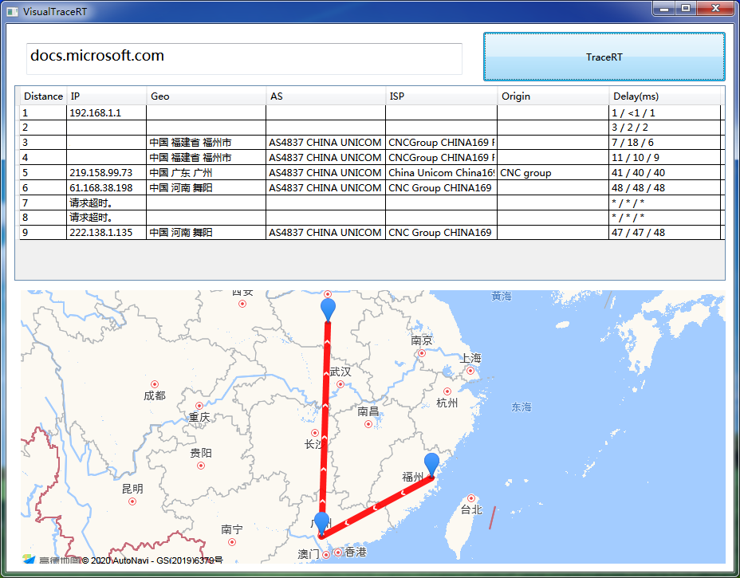

# VisualTraceRT

> 可视化显示traceroute结果

IP解析: [ip-api.com](http://ip-api.com)

地图SDK: [高德地图](https://lbs.amap.com/)

---

界面样式

下载地址：

### [VisualTraceRT](https://injectrl.github.io/VisualTraceRT/VisualTraceRT.exe)

---

更新日志：

- 1.1

	1.修正部分描述
	2.完善版本号

- 1.0

	1. 实现基本的C#壳tracert
	2. 加入自动更新